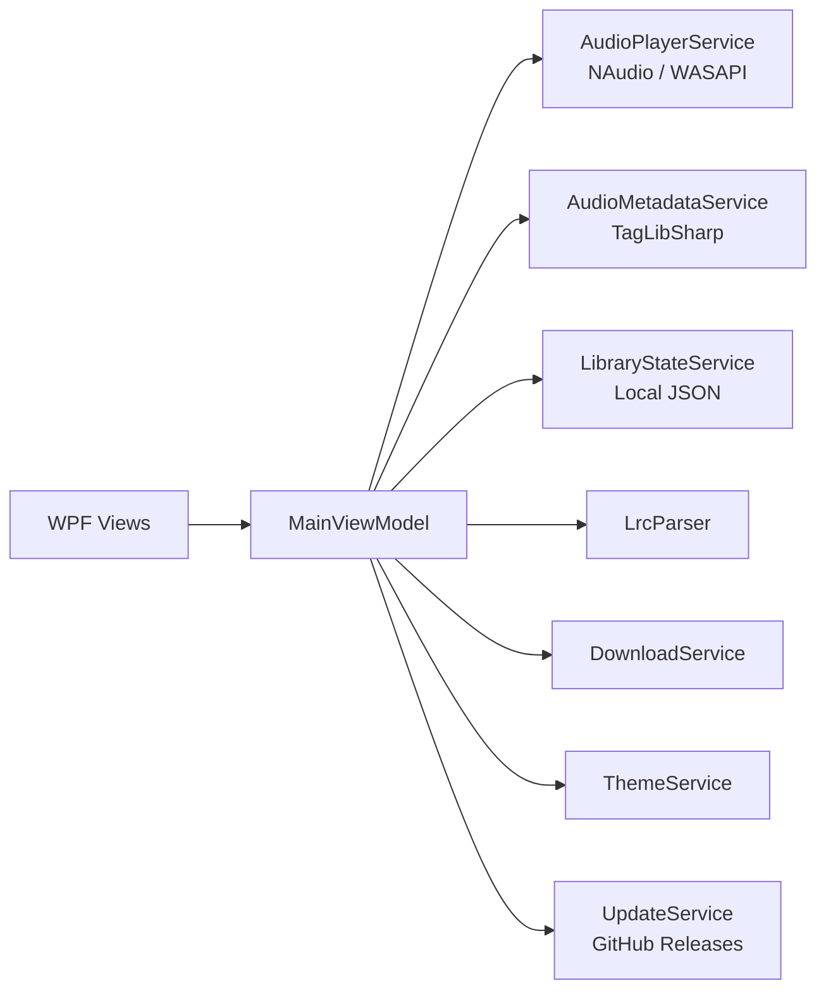

<p align="center">
  
</p>

<h1 align="center">KugouPlayer</h1>

<p align="center">
  一款使用 .NET 8 与 WPF 构建的 Windows 桌面音乐播放器，<br />
  以本地音乐体验为核心，并参考酷狗音乐 PC 20 的界面布局与交互方式。
</p>

<p align="center">
  
  
  
  
  
</p>

> [!IMPORTANT]
> KugouPlayer 是独立的学习与演示项目，并非酷狗音乐官方客户端，也不隶属于酷狗音乐或腾讯音乐娱乐集团。项目不提供破解、会员绕过或未经授权的在线曲库访问能力。

## 目录

- [项目简介](#项目简介)
- [主要功能](#主要功能)
- [当前边界](#当前边界)
- [技术栈](#技术栈)
- [架构概览](#架构概览)
- [环境要求](#环境要求)
- [快速开始](#快速开始)
- [发布构建](#发布构建)
- [测试](#测试)
- [数据位置](#数据位置)
- [项目结构](#项目结构)
- [参与贡献](#参与贡献)
- [商标与版权声明](#商标与版权声明)

## 项目简介

KugouPlayer 旨在探索现代 Windows 音乐播放器的完整实现方式：从 WPF 界面、MVVM 状态管理、本地媒体资料库，到基于 WASAPI 的音频播放、均衡器、歌词同步和系统媒体键支持。

项目采用本地优先设计。音乐文件、收藏、播放历史、用户歌单和设置均保存在用户电脑中；除检查 GitHub Releases 更新以及用户主动创建的下载任务外，应用不会主动请求第三方音乐服务。

当前功能矩阵已完成 **31/34 项（91.2%）**。详细范围和验收记录见 [DEVELOPMENT_PLAN.md](./DEVELOPMENT_PLAN.md)。

## 主要功能

### 播放与音频

- 基于 NAudio 与 WASAPI Shared Mode 的本地音频播放
- 播放、暂停、上一首、下一首、进度跳转、音量与静音控制
- 顺序播放、单曲循环和随机播放
- 播放队列管理、移除歌曲与清空队列
- 10 段均衡器预设与左右声道平衡
- Windows 活动音频输出设备枚举、运行时切换及默认设备回退
- 支持 Windows 媒体键和系统托盘快捷控制

### 本地音乐资料库

- 多文件导入与文件夹递归扫描
- 按歌曲名、歌手等条件筛选与排序
- 使用 TagLibSharp 读取歌曲名称、歌手、专辑、时长和内嵌封面
- 收藏歌曲、最近播放、播放次数和上次播放位置
- 创建、重命名和删除本地歌单
- 本地 JSON 持久化，重启后自动恢复资料库与设置

### 歌词与视觉体验

- LRC 歌词解析、时间轴同步和自动滚动
- 独立桌面歌词窗口、置顶和锁定
- 沉浸式播放详情页
- 参考酷狗音乐 PC 20 的顶部导航、侧栏、内容卡片和底部播放栏
- 浅色、深色主题即时切换
- 无边框窗口、拖动、缩放、最大化、最小化到托盘

### 内容与工具

- 首页、乐库、歌单、排行榜、频道、视频和有声内容页面
- 搜索结果、热搜建议和搜索历史
- 本地视频播放窗口
- HTTP/HTTPS 下载任务、暂停、继续、移除和下载目录管理
- GitHub Releases 版本检查与关于页面

## 当前边界

以下能力依赖酷狗官方授权接口或商业服务，当前版本不提供：

- 酷狗账户登录与多端同步
- VIP 会员、支付及数字版权权益
- 正版在线曲库、音乐云盘、直播和投屏
- 迷你播放器（已按项目范围明确排除）

下载管理仅用于用户拥有版权、已获授权或允许公开下载的媒体地址。使用者应自行确认内容来源及使用权限。

## 技术栈

| 技术 | 版本 | 用途 |
|---|---:|---|
| .NET | 8.0 | 应用运行时与基础类库 |
| WPF | .NET 8 | Windows 桌面界面 |
| CommunityToolkit.Mvvm | 8.4.2 | MVVM、命令与属性通知 |
| NAudio | 2.3.0 | 音频解码、采样处理与 WASAPI 输出 |
| TagLibSharp | 2.3.0 | 音频标签和内嵌封面读取 |
| System.Text.Json | .NET 8 | 本地资料库与设置持久化 |

## 架构概览



界面层只负责展示和窗口交互，主要业务状态集中在 `MainViewModel`；音频、元数据、持久化、下载、主题和更新检查分别由独立服务处理。

## 环境要求

- Windows 10 或 Windows 11
- [.NET 8 SDK](https://dotnet.microsoft.com/download/dotnet/8.0)
- 至少一个可用的 Windows 音频输出设备
- Visual Studio 2022（可选，推荐安装“.NET 桌面开发”工作负载）

支持导入的文件扩展名：

`MP3`、`WAV`、`WMA`、`AAC`、`M4A`、`FLAC`、`OGG`

> 部分格式依赖 Windows Media Foundation 或系统已安装的解码器，实际可播放范围可能因 Windows 版本而异。

## 快速开始

### 1. 克隆仓库

```powershell
git clone https://github.com/NobiNobita-GC/KugouPlayer.git
cd KugouPlayer
```

### 2. 还原并构建

```powershell
dotnet restore .\KugouPlayer.sln
dotnet build .\KugouPlayer.sln --configuration Debug
```

### 3. 运行应用

```powershell
dotnet run --project .\KugouPlayer\KugouPlayer.csproj
```

首次启动后，点击“导入本地音乐”，选择音频文件或扫描音乐文件夹即可开始使用。

## 发布构建

生成依赖本机 .NET 8 Desktop Runtime 的 Windows x64 发布版本：

```powershell
dotnet publish .\KugouPlayer\KugouPlayer.csproj `
  --configuration Release `
  --runtime win-x64 `
  --self-contained false
```

默认输出目录：

```text
KugouPlayer/bin/Release/net8.0-windows/win-x64/publish/
```

项目内置 GitHub Releases 更新检查。发布新版本时，建议：

1. 更新 `KugouPlayer.csproj` 中的 `<Version>`。
2. 创建与程序集版本一致的 Git 标签，例如 `v1.1.0`。
3. 在 GitHub Releases 中发布该标签并上传构建产物。

## 测试

运行烟雾测试：

```powershell
dotnet run --project .\KugouPlayer.SmokeTests\KugouPlayer.SmokeTests.csproj
```

当前测试覆盖：

- LRC 时间格式解析和缺失文件处理
- 本地资料库设置 JSON 往返序列化
- 均衡器采样处理与防削波
- 立体声声道平衡
- GitHub Release 语义版本比较
- Windows WASAPI 活动输出端点枚举

当前基线：**7/7 检查通过，解决方案构建 0 警告、0 错误。**

## 数据位置

| 数据 | 默认位置 |
|---|---|
| 本地资料库与设置 | `%LOCALAPPDATA%\KugouPlayer\library.json` |
| 下载文件 | `%USERPROFILE%\Music\KugouPlayer` |

删除 `library.json` 会重置本地资料库、收藏、历史、歌单和应用设置，但不会删除原始音乐文件。

## 项目结构

```text
KugouPlayer/
├─ KugouPlayer/                  # WPF 主应用
│  ├─ Assets/                    # 图片和封面资源
│  ├─ Converters/                # WPF 值转换器
│  ├─ Models/                    # 歌曲、歌单、下载和持久化模型
│  ├─ Resources/                 # 主题颜色与全局控件样式
│  ├─ Services/                  # 音频、元数据、歌词、下载等服务
│  ├─ ViewModels/                # MVVM 状态与命令
│  └─ Views/                     # 主窗口、桌面歌词和视频窗口
├─ KugouPlayer.SmokeTests/       # 可独立运行的烟雾测试
├─ DEVELOPMENT_PLAN.md           # 功能矩阵与验收记录
└─ KugouPlayer.sln               # Visual Studio 解决方案
```

## 参与贡献

欢迎提交 Issue 和 Pull Request。建议流程：

1. Fork 本仓库并从最新主分支创建功能分支。
2. 保持改动聚焦，并沿用现有 MVVM 与资源字典结构。
3. 提交前运行完整构建和烟雾测试。
4. 在 Pull Request 中说明行为变化、验证方式和必要的界面截图。

如需接入在线音乐、账户或会员服务，请仅使用版权所有方提供的正式 API、SDK 和授权凭据。

## 商标与版权声明

“酷狗音乐”、相关名称、界面特征和商标归其各自权利人所有。本项目中的参考实现仅用于软件工程学习、WPF 技术研究和非商业演示，不代表任何官方合作、授权或背书。

仓库当前未附带开源许可证。在公开分发、二次开发或接受外部贡献前，请由仓库所有者补充合适的 `LICENSE` 文件。

---

如果这个项目对你有帮助，欢迎点亮 Star，或通过 Issue 分享改进建议。
